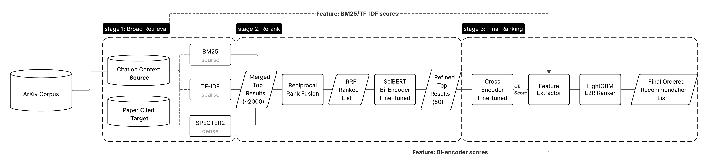
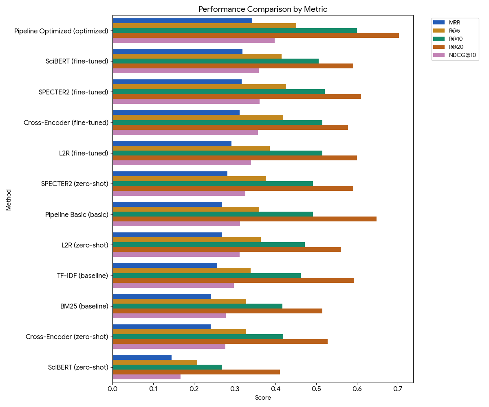
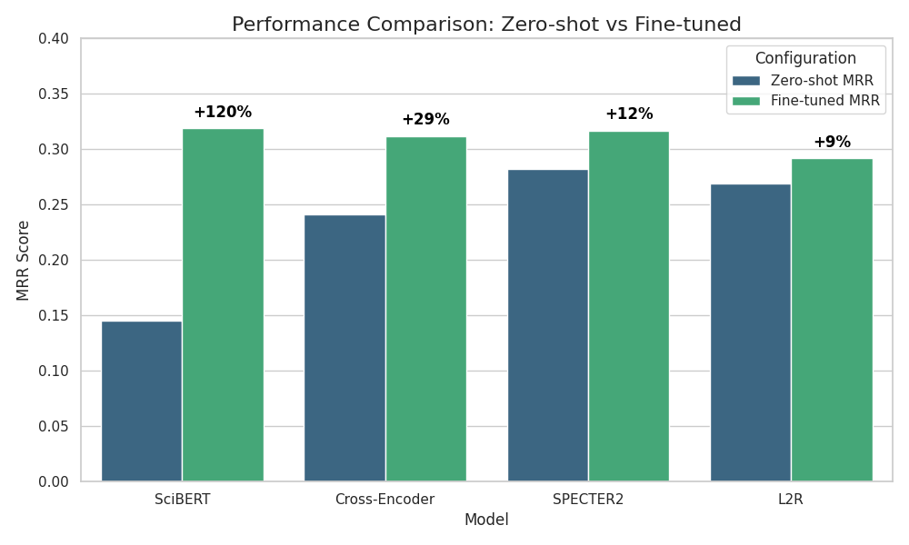

**Citation Recommendation for Computer Science Papers:**

**A Multi-Stage Retrieval Approach**

Yubo Zhou, Shaoying Zheng, Yiran Chen

# Introduction

Academic research is fundamentally cumulative. Each new contribution builds upon, extends, or challenges prior work, and citations serve as the formal mechanism for acknowledging these intellectual connections. When a researcher writes a sentence claiming that "transformer architectures have revolutionized natural language processing," they must support this claim with references to the relevant literature. Selecting appropriate citations is therefore a core skill in academic writing—one that requires familiarity with the literature, judgment about which sources best support a given claim, and awareness of the conventions within one's field. However, the task of finding appropriate citations has become increasingly challenging. The volume of academic literature has grown exponentially over recent decades. ArXiv alone receives over 15,000 new submissions per month in physics, mathematics, and computer science (Boboris, 2023). PubMed adds over a million new biomedical articles each year (National Library of Medicine, 2024). Even within narrow subfields, staying current with the literature requires substantial effort. A researcher writing about large language models in 2024 faces thousands of potentially relevant papers published in just the past few years. Identifying which papers are most appropriate to cite for a particular claim—among this vast and rapidly growing body of work—is a non-trivial information retrieval problem.

Citation recommendation systems aim to address this challenge by automatically suggesting relevant papers given the context in which a citation is needed. The task can be formulated as follows: given a citation context (typically a sentence or passage where a researcher intends to add a citation), retrieve and rank papers from a large corpus according to their appropriateness as references for that context. This formulation treats citation recommendation as an information retrieval task, where the citation context serves as the query and the corpus of academic papers serves as the document collection. The citation recommendation task presents unique challenges compared to general web search or document retrieval. Citation contexts are often technical and domain-specific, using specialized vocabulary that requires understanding of the field. The relevance of a cited paper depends not just on topical similarity but on the specific claim being made—a paper on attention mechanisms might be cited when discussing model architectures, training efficiency, or interpretability, each requiring different supporting references. Furthermore, the notion of what constitutes an appropriate citation is shaped by disciplinary norms and evolves over time as new influential papers emerge and older references become less central.

In this project, we develop and evaluate a citation recommendation system for computer science and machine learning literature. Our system follows a multi-stage retrieval architecture that progressively refines candidate papers through three stages. In the first stage, initial retrieval methods—both sparse (BM25, TF-IDF) and dense (SPECTER2)—retrieve a broad set of potentially relevant candidates from the corpus. In the second stage, a neural bi-encoder reranks these candidates. In the third stage, more computationally expensive models including cross-encoders and a learning-to-rank model with 17 hand-crafted features produce the final ranking. We construct our dataset from ArXiv papers in computer science and machine learning, spanning publications from 2011 to 2024. The dataset contains 12,587 training instances, 1,580 validation instances, and 1,888 test instances, where each instance pairs a citation context with the paper that was actually cited in that context. We evaluate systems on their ability to rank the ground-truth cited paper above negative candidates, using Mean Reciprocal Rank (MRR), Recall@K, and NDCG@K as evaluation metrics. We implement and compare a range of retrieval and ranking methods representing different paradigms in information retrieval. Traditional sparse methods (BM25, TF-IDF) rely on lexical matching and term statistics. Dense retrieval methods (SPECTER2, SciBERT) encode queries and documents into dense vector representations using pre-trained language models, enabling semantic matching beyond exact term overlap. Neural reranking methods (cross-encoders) jointly encode query-document pairs to capture fine-grained relevance signals. Learning-to-rank methods combine multiple features through gradient-boosted decision trees. We evaluate each method in both zero-shot settings (using pre-trained models directly) and after fine-tuning on our citation recommendation training data.

Our experiments yield several findings. First, the optimized multi-stage pipeline achieves the best performance with an MRR of 0.343, meaning the correct cited paper appears at approximately rank 3 on average. This represents a 42% improvement over the BM25 baseline. Second, among individual models, SPECTER2 shows strong zero-shot performance, substantially outperforming other neural models without task-specific training. This advantage stems from SPECTER2's pre-training objective, which uses citation links to learn document similarity—directly aligned with our downstream task. Third, fine-tuning dramatically improves some models: SciBERT improves by 120% after fine-tuning, while SPECTER2's improvement is more modest at 12%. This suggests that models with misaligned pre-training objectives can still achieve strong performance given sufficient task-specific supervision.

The remainder of this report is organized as follows. We describe our dataset and its construction in Section 2. Section 3 reviews related work in citation recommendation and neural information retrieval. Section 4 details our methods, including the retrieval, reranking, and ranking components of our pipeline, as well as our feature engineering for learning-to-rank. Section 5 presents our experimental results and analysis. Section 6 discusses the implications of our findings, limitations of our work, and practical applications. Section 7 summarizes our conclusions. Section 8 describes additional approaches we explored that did not yield improvements. Section 9 reflects on what we would do differently. Section 10 describes the contributions of each team member.

# Data

We frame citation recommendation as a retrieval task: given a citation context, the system must identify the correct paper to cite from a pool of candidates. Each instance in our dataset represents a single citation event, where one paper (the source) cites another paper (the target) within a specific textual context. The system's goal is to rank the ground-truth target paper above all negative candidates.

Our dataset is constructed from the ArXiv preprint repository, focusing on computer science and machine learning literature. The papers span publication years from 2011 to 2024, capturing over a decade of research that includes major developments in deep learning, natural language processing, and computer vision. Table 1 shows the distribution across ArXiv categories. Machine learning (cs.LG) is the most represented category, followed by computation and language (cs.CL) and computer vision (cs.CV). Papers often belong to multiple categories, so these counts are not mutually exclusive.

**Table 1: Distribution of ArXiv Categories**

| Category | Description | Count |
|----------|-------------|-------|
| cs.LG | Machine Learning | 2,492 |
| cs.CL | Computation and Language | 1,660 |
| cs.CV | Computer Vision | 1,381 |
| cs.AI | Artificial Intelligence | 1,327 |
| stat.ML | Statistics - Machine Learning | 807 |
| cs.NE | Neural and Evolutionary Computing | 351 |
| cs.CY | Computers and Society | 207 |
| cs.IR | Information Retrieval | 126 |
| cs.AR | Hardware Architecture | 121 |
| cs.GR | Graphics | 40 |

Each sample contains four components. The **citation context** is the textual passage in which the citation occurs—typically one or more sentences establishing the claim being supported. Citation contexts in our dataset have a mean length of 46 words. The **source paper** is the paper making the citation, for which we include ArXiv ID, title, abstract, category labels, and publication year. The **target paper** is the ground-truth paper that was actually cited, with the same metadata fields. The **negative samples** are papers not cited in this context, serving as distractors that the model must distinguish from the true target. We also record the section where the citation appears (e.g., Introduction, Related Work, Methods), which may provide signal about the citation's nature.

We split our data at the source paper level to prevent data leakage, ensuring that papers in the test set do not appear in training. The splits are stratified by publication year bins to maintain temporal consistency. Table 2 shows the partition into training, validation, and test sets. The training set uses a 1:10 negative sampling ratio, pairing each positive with 10 negatives for 11 candidates per query. This balances computational efficiency with sufficient negative signal for learning. The validation and test sets use a more challenging 1:99 ratio, where each query has 100 candidates. This setup more closely simulates realistic retrieval where the correct paper must be identified from a large pool of alternatives.

**Table 2: Dataset Split Statistics**

| Split | Source Papers | Samples | Negative Ratio | Candidates per Query |
|-------|---------------|---------|----------------|---------------------|
| Train | 297 | 12,587 | 1:10 | 11 |
| Validation | 37 | 1,580 | 1:99 | 100 |
| Test | 38 | 1,888 | 1:99 | 100 |
| **Total** | **372** | **16,055** | — | — |

The complete corpus comprises unique papers serving different roles (Table 3). Source papers are those making citations, while target papers are those being cited. The asymmetry reflects the natural structure of citation networks, where a smaller set of highly-cited papers are referenced by a larger set of citing papers.

**Table 3: Corpus Composition**

| Paper Role | Unique Count |
|------------|--------------|
| Source papers (citing) | 372 |
| Target papers (cited) | 4,504 |

We applied several quality constraints during dataset construction. For temporal consistency, we require that the source paper's publication year be greater than or equal to the target's, preventing temporal leakage and reflecting the real-world constraint that papers can only cite prior work. For text quality, citation contexts must contain at least 10 words, filtering out contexts that lack sufficient semantic content. For uniqueness, each source-target pair appears at most once, preventing data leakage across samples. For completeness, all papers must have both title and abstract available, as these fields are essential inputs to our retrieval models.

# Related Work

Our work builds on research in citation recommendation, scientific document representation, and information retrieval. Our baseline retrieval methods draw on decades of work in probabilistic information retrieval. Robertson and Zaragoza (2009) provide a comprehensive treatment of the probabilistic relevance framework, including the BM25 ranking function that serves as one of our primary baselines. BM25 remains effective despite its simplicity, and their work establishes the theoretical foundations for term-frequency-based retrieval that continues to underpin modern systems.

The task of recommending citations based on local context has been studied for over a decade. CiteSight (Livne et al., 2014) was an early influential system that demonstrated the viability of context-aware citation recommendation. Their system analyzed text surrounding a citation placeholder to recommend relevant papers, establishing the paradigm that local context provides crucial signal for identifying appropriate references. CiteSight used differential search to contrast local context against the broader document, identifying terms distinctively relevant to the specific citation need. Our work follows this paradigm—using citation context as a query to retrieve relevant papers—but employs modern neural methods.

Ebesu and Fang (2017) advanced the field by introducing neural approaches. Their Neural Citation Network used deep learning to model semantic relationships between citation contexts and candidate papers, moving beyond lexical matching. The neural approach captured semantic similarity even when context and cited paper used different vocabulary for the same concepts. Our work continues in this direction with transformer-based models (SPECTER2, SciBERT, cross-encoders). More recently, Gu et al. (2022) proposed a two-stage retrieve-and-rerank approach that has become common in neural information retrieval. Their system first retrieves candidates with an efficient model, then applies an expensive SciBERT-based reranker. This cascaded architecture balances efficiency with ranking quality. Our multi-stage pipeline follows a similar philosophy.

Effective citation recommendation also requires high-quality document representations. Cohan et al. (2020) introduced SPECTER, which uses citation links as training signal. The key insight is that citations provide natural supervision: papers that cite each other are likely semantically related, and this relationship can train embeddings that capture scientific relevance. We use SPECTER2, the successor to SPECTER, as one of our primary retrieval models. Singh et al. (2022) introduced SciRepEval, a benchmark for evaluating scientific document representations, confirming the strength of citation-informed models for document-level similarity tasks.

Our work synthesizes these insights into a comprehensive experimental study. While prior work typically proposes and evaluates a single method, we systematically compare sparse retrieval, dense retrieval, neural reranking, and learning-to-rank approaches, both zero-shot and fine-tuned. This allows us to draw broader conclusions about which factors most influence citation recommendation performance.

# Methods

We adopt a multi-stage retrieval pipeline that progressively refines the candidate set through three stages: initial retrieval, reranking, and final ranking. This cascade architecture is common in information retrieval, where computationally efficient methods first reduce the search space, allowing more expensive models to focus on a smaller candidate set. Figure 1 illustrates the overall architecture. Our implementation supports flexible configuration of different methods at each stage, enabling systematic comparison of various approaches.

The first stage retrieves an initial set of candidate papers from the corpus using three methods: two sparse (BM25 and TF-IDF) and one dense (SPECTER2). For BM25, we use the BM25Okapi implementation from rank_bm25 with $k_1 = 1.5$ and $b = 0.75$. Documents are represented by concatenating title and abstract, with tokenization by lowercasing and whitespace splitting. For TF-IDF, we use scikit-learn's TfidfVectorizer with maximum 10,000 features, unigrams and bigrams, minimum document frequency of 2, and maximum document frequency of 0.8. Vectors are L2-normalized, and relevance is computed as cosine similarity. For dense retrieval, we use SPECTER2, a transformer model pre-trained on citation graphs to produce similar embeddings for papers that cite each other. Documents are encoded by passing title and abstract through SPECTER2, producing 768-dimensional embeddings indexed with FAISS for efficient nearest neighbor search. We dynamically select index type based on corpus size: flat index with exact search for small corpora, IVF index with 100 clusters for larger ones. At query time, relevance is computed as $score = 1 / (1 + distance)$ where distance is L2 distance between embeddings. When SPECTER2 is unavailable, the system falls back to SciBERT.

The second stage reranks Stage 1 candidates using a SciBERT bi-encoder, implemented via sentence-transformers. The bi-encoder encodes citation context and candidate documents independently, with relevance computed as cosine similarity. Unlike Stage 1 dense retrieval which searches the entire corpus, the bi-encoder only scores candidates passed from Stage 1.

The third stage applies the most expensive models: a cross-encoder and a learning-to-rank model. The cross-encoder processes query and document together as a single sequence, allowing full attention between tokens; we use cross-encoder/ms-marco-MiniLM-L-12-v2, processing candidates in batches of 32. The learning-to-rank model uses LightGBM with lambdarank objective, taking a 17-dimensional feature vector for each query-document pair, allowing the model to learn optimal feature weights that capture complementary signals.

Our learning-to-rank model uses 17 features in five categories. IR features (4) include BM25 score, TF-IDF cosine similarity, title term overlap ratio, and abstract term overlap ratio. Embedding features (3) include SPECTER2 cosine similarity, SciBERT cosine similarity, and cross-encoder relevance score. Category features (4) capture relationships between source and target ArXiv categories: primary category match, category overlap ratio, same AI/ML domain indicator, and related category match. Temporal features (3) include year difference between source and target, target recency, and a binary indicator for papers published within the last 2 years. Context features (3) include citation text length, abstract length ratio, and number of categories assigned to the candidate.

We evaluate two pipeline configurations. The Basic Pipeline uses only traditional retrieval methods without neural reranking or learning-to-rank, serving as a baseline. The Optimized Pipeline combines all components with fine-tuned models: BM25, TF-IDF, and fine-tuned SPECTER2 in Stage 1; fine-tuned SciBERT bi-encoder in Stage 2; fine-tuned cross-encoder and L2R in Stage 3.

We fine-tune four models on our training data: SciBERT bi-encoder, SPECTER2 dense retriever, cross-encoder, and L2R. For the neural models, we use contrastive learning: each training instance has a citation context as query, the ground-truth paper as positive, and sampled papers as negatives. Models learn to score positive pairs higher than negative pairs. The L2R model trains directly on feature vectors with lambdarank objective.

# Evaluation and Results

We evaluate using standard information retrieval metrics. Mean Reciprocal Rank (MRR) is our primary metric: for each query, reciprocal rank is 1/r where r is the rank of the correct paper, and MRR averages across queries. MRR is appropriate because each citation context has exactly one ground-truth paper, and users benefit most when it appears near the top. Recall@K measures the proportion of queries where the correct paper appears in the top K results; we report K = 5, 10, and 20. NDCG@10 measures ranking quality with position-based discounting. All experiments use the test set of 1,888 instances, each with 100 candidates (1 positive, 99 negatives).

Table 5 presents results for our main methods sorted by MRR. The best configuration is the Optimized Pipeline at MRR = 0.343, Recall@10 = 0.600, and NDCG@10 = 0.398. This means the correct paper appears at approximately rank 3 on average, and within the top 10 results 60% of the time. Among sparse retrieval baselines, TF-IDF (MRR = 0.257) outperforms BM25 (MRR = 0.242) by 6.2%, suggesting that bigram features and IDF weighting capture useful signals beyond simple term matching. SPECTER2 substantially outperforms sparse baselines even zero-shot, achieving MRR = 0.282 compared to 0.242 for BM25—a 16.5% improvement. This confirms that dense embeddings capture citation relevance signals that lexical methods miss. SciBERT zero-shot performs poorly (MRR = 0.145), below even BM25. The Cross-Encoder zero-shot (MRR = 0.241) performs comparably to BM25 despite being more sophisticated; the MS MARCO training domain differs substantially from academic citations, limiting effectiveness without fine-tuning. The L2R model zero-shot (MRR = 0.269) outperforms all sparse baselines and zero-shot neural rerankers, demonstrating the value of combining multiple signals through learned feature weights.

**Table 5: Experimental Results**

| Method | Variant | MRR | R@5 | R@10 | R@20 | NDCG@10 |
|--------|---------|-----|-----|------|------|---------|
| Pipeline Optimized | optimized | 0.343 | 0.451 | 0.600 | 0.703 | 0.398 |
| SciBERT | fine-tuned | 0.319 | 0.415 | 0.506 | 0.591 | 0.359 |
| SPECTER2 | fine-tuned | 0.317 | 0.426 | 0.521 | 0.610 | 0.361 |
| Cross-Encoder | fine-tuned | 0.312 | 0.419 | 0.515 | 0.578 | 0.357 |
| L2R | fine-tuned | 0.292 | 0.386 | 0.515 | 0.600 | 0.340 |
| SPECTER2 | zero-shot | 0.282 | 0.377 | 0.492 | 0.591 | 0.326 |
| Pipeline Basic | basic | 0.269 | 0.360 | 0.492 | 0.648 | 0.313 |
| L2R | zero-shot | 0.269 | 0.364 | 0.472 | 0.561 | 0.312 |
| TF-IDF | baseline | 0.257 | 0.339 | 0.462 | 0.593 | 0.298 |
| BM25 | baseline | 0.242 | 0.328 | 0.417 | 0.515 | 0.278 |
| Cross-Encoder | zero-shot | 0.241 | 0.328 | 0.419 | 0.528 | 0.277 |
| SciBERT | zero-shot | 0.145 | 0.208 | 0.269 | 0.411 | 0.167 |

Fine-tuning yields substantial improvements for all models (Table 6). SciBERT shows the largest gain (+120%), transforming from worst to near-best, indicating its representations can be adapted through task-specific training despite poor zero-shot performance. Cross-Encoder improves by 29%, benefiting from domain adaptation. SPECTER2 improves modestly (+12%), expected since its pre-training already aligns with the task. L2R improves least (+9%), suggesting hand-crafted features already capture most relevant signals. After fine-tuning, the gap narrows: fine-tuned SciBERT (0.319) slightly outperforms fine-tuned SPECTER2 (0.317), suggesting that with sufficient training data, the choice of pre-trained model matters less than the fine-tuning process.

**Table 6: Zero-shot vs Fine-tuned Performance**

| Model | Zero-shot MRR | Fine-tuned MRR | Absolute Gain | Relative Gain |
|-------|---------------|----------------|---------------|---------------|
| SciBERT | 0.145 | 0.319 | +0.174 | +120% |
| Cross-Encoder | 0.241 | 0.312 | +0.071 | +29% |
| SPECTER2 | 0.282 | 0.317 | +0.035 | +12% |
| L2R | 0.269 | 0.292 | +0.023 | +9% |

The multi-stage pipelines demonstrate the value of combining methods. The Basic Pipeline (MRR = 0.269) achieves performance comparable to L2R zero-shot, with notably high Recall@20 (0.648) from aggregating diverse retrieval results. The Optimized Pipeline achieves the best overall performance (MRR = 0.343), a 42% improvement over BM25 and 28% over fine-tuned SciBERT, demonstrating that the three-stage architecture captures complementary signals no single method provides alone.

# Discussion

Our experiments reveal several patterns about how different retrieval paradigms perform on citation recommendation. The strong zero-shot performance of SPECTER2 compared to other neural models underscores the importance of alignment between pre-training objectives and downstream tasks. SPECTER2 is trained to produce similar embeddings for papers connected by citation links, which directly mirrors what we ask at inference time. In contrast, SciBERT's masked language modeling teaches the model to understand scientific text but not to judge document-level similarity, explaining why it performs worse than even BM25 zero-shot. However, SciBERT's dramatic improvement after fine-tuning (+120%) suggests latent capacity that task-specific training unlocks. This has practical implications: when sufficient training data is available, the choice of pre-trained model may matter less than the fine-tuning process itself. The success of the optimized pipeline (MRR = 0.343) demonstrates that different paradigms capture complementary signals—sparse methods excel at exact term matching, dense methods capture semantic similarity, cross-encoders model fine-grained interactions. However, combining them effectively requires care; as we discuss in Section 8, not all combination strategies help.

Our system has several potential applications in academic workflows. For researchers writing papers, it can suggest relevant literature that might be overlooked; given a sentence expressing a claim, the system retrieves papers that others have cited in similar contexts. For peer reviewers, it can assist in evaluating citation appropriateness—if a cited paper ranks very low, it may warrant closer inspection, though human judgment remains necessary. For researchers exploring new fields, the system provides literature discovery through example sentences rather than keyword queries.

Our work also has several limitations. With 1,888 test instances, our evaluation has reasonable statistical power, though a production system would benefit from even larger evaluation sets. Our dataset consists entirely of CS/ML papers from ArXiv, and citation practices vary across disciplines—models may not generalize to other fields. Perhaps most significantly, our negatives are sampled randomly, creating a relatively easy discrimination task. In realistic scenarios, the challenge is choosing among several topically similar papers that differ in specific contributions. Constructing hard negatives would provide more realistic training signal, but identifying them requires domain expertise beyond what is feasible for a course project. The consequence is that our metrics likely overestimate real-world performance. Finally, our evaluation assumes each context has exactly one correct answer, but multiple papers might be appropriate, and author choices depend on factors beyond semantic relevance. Our metrics penalize valid alternatives.

Several directions could extend this work. Training on larger, more diverse datasets would likely improve robustness. Hard negative mining—using highly-ranked incorrect retrievals or citation graph structure to find related-but-distinct papers—could improve discriminability. Cross-domain evaluation would test generalization beyond computer science. Additional signals such as citation graph structure, author networks, or temporal patterns could provide complementary information. Ultimately, user studies with researchers actively writing papers would reveal how the system performs in practice.

# Conclusion

We developed a citation recommendation system using a multi-stage retrieval pipeline that combines sparse retrieval, dense retrieval, neural reranking, and learning-to-rank. Our best configuration achieves MRR = 0.343, a 42% improvement over BM25. Pre-training alignment matters substantially for zero-shot performance—SPECTER2 outperforms SciBERT by a wide margin—but fine-tuning can overcome this gap, with SciBERT improving 120% after task-specific training. Multi-stage pipelines outperform individual methods by capturing complementary signals, though combination strategies require care. Our analysis suggests that operating on abstracts alone fundamentally limits performance, pointing toward full-text approaches for future work. The code for this project is available at https://github.com/everydaylucky/si650.

# Other Things We Tried & Error Analysis

This section documents approaches we explored that did not yield anticipated improvements. We expected Reciprocal Rank Fusion (RRF) to improve performance by combining the strengths of multiple retrieval systems—different retrievers making different errors, their combination more robust than any individual. Instead, RRF underperformed: zero-shot RRF achieved MRR of 0.235, lower than BM25 alone (0.242), and fine-tuned RRF was worse at 0.211. RRF treats all systems equally using only rank positions, ignoring score magnitudes. When one retriever (SPECTER2) is substantially more accurate, RRF dilutes its signal by averaging with weaker systems. RRF did achieve high Recall@20 (0.606), suggesting it successfully aggregates diverse candidates, but ranking quality suffers. A weighted fusion approach learning system-specific weights might address this.

We also tried Pseudo-Relevance Feedback, which achieved MRR of 0.250—a modest improvement over BM25 (0.242) but below TF-IDF (0.257). For citation recommendation, the initial query already contains key terms; expansion terms from top documents may introduce topic drift, adding terms related to the general area but not specific to the citation need.

We hypothesized that text surrounding the citation sentence would provide additional signal. We tried including text before the citation, after it, and both. All variants produced identical results to the baseline (MRR = 0.343), indicating no benefit. Authors apparently craft citation sentences as self-contained justifications; surrounding text does not add discriminative information.

Finally, we tried appending the source paper's title and truncated abstract to the citation context, expecting the source topic to help disambiguate. This achieved MRR of 0.341, marginally lower than without enhancement (0.343). The source paper information is likely redundant with category-based features already in our pipeline.

At the early stage, we conducted experiments on a small subset of the data (76 source papers, 709 citation instances) to see if full-text papers would improve performance. Since it's hard to compute embeddings for full texts, we used first 2000 and 5000 words as proxies. Surprisingly, using full text led to worse performance (MRR = 0.578 for 2000 words, 0.569 for 5000 words) compared to using abstracts only (MRR = 0.616). This counterintuitive result may stem from noise introduced by irrelevant sections in full text, diluting the signal from abstracts. The small dataset size also limits generalizability. This early experiment reinforced our decision to focus on abstracts for the main project.

# What We Would Have Done Differently

If we were to restart this project, we would fundamentally change how we handle full-text data. Our error analysis above revealed that simply ingesting the full text of papers degraded performance because it drowned the relevant signal in noise—embedding a 10-page paper dilutes the specific insight being cited. Therefore, rather than using "more text", we would implement Intent-Aware Scoped Retrieval. This approach rests on the insight that citations are functional: authors cite papers to credit a method, compare a result, or use a definition. A single vector representing an entire paper cannot capture these distinct modalities.

We would implement a two-step "Router-Retriever" architecture:

1. Citation Intent Classification (The "Router"): Instead of treating the citation context merely as a bag of words, we would use an LLM or a fine-tuned classifier to determine the semantic role of the citation.
- Example: "We use the pre-training objective from [X]..." $\rightarrow$ Tag: Methodology
- Example: "State-of-the-art results were achieved by [Y]..." $\rightarrow$ Tag: Experimental Results
2. Structure-Aware Indexing: Instead of indexing papers as monolithic documents, we would parse the PDF structure (using tools like GROBID) to segment papers into discourse units (Introduction, Methodology, Results, Conclusion).
3. Scoped Retrieval: At inference time, the system would use the predicted intent to "route" the retrieval to the relevant section of the candidate papers. If the query implies a methodological citation, the system would compute similarity scores only against the "Methodology" sections of the corpus, ignoring the noise from Introductions or unrelated Discussions.

This approach addresses the root cause of our full-text failure. The problem wasn't that the full text didn't contain the answer; it was that the retriever couldn't distinguish the answer from the surrounding irrelevant text. By constraining the search space semantically, we would increase the signal-to-noise ratio significantly. While classifying intent requires modern NLP techniques (like LLMs), the core challenge remains a retrieval one: designing an index that supports dynamic, field-specific querying based on semantic context.

We recognized this potential problem early in the project. We discussed whether operating on abstracts alone would be sufficient, and we understood the theoretical argument that full text should be necessary. However, we made a pragmatic choice to proceed with abstracts anyway, hoping that the semantic similarity between citation contexts and abstracts would be strong enough to yield useful results. This hope was, in retrospect, a form of wishful thinking. We wanted to work with large-scale data, and large-scale full-text data is difficult to obtain. ArXiv provides metadata and abstracts freely, but full text access is more complex—many academic papers are behind publisher paywalls, protected by copyright, or available only through institutional subscriptions. Building a large corpus of full-text papers would require navigating these access restrictions, potentially raising legal concerns, and investing significant time in data collection and processing. So we chose the path of least resistance: use abstracts, collect more data, and hope that scale would compensate for the missing information. Our results suggest this was the wrong trade-off.

If we could start over, we would take the opposite approach: prioritize full text over scale. Even if we could only obtain full text for a small number of papers—say, 5 to 10 source papers with their complete reference lists, rather than hundreds—we believe the resulting system would be more principled and potentially more effective. With full text, our retrieval models could actually match citation contexts against the specific content being cited. The system would be solving the right problem, even if on a smaller scale. This would require accepting severe constraints: we might have only a few dozen citation instances for training and evaluation, rather than thousands, and our experiments would be less statistically powerful. But the system would be built on solid foundations, and positive results would be more meaningful because they would demonstrate that the approach actually works when given the necessary information. The practical path would involve focusing on open-access papers, manually downloading PDFs, and processing them to extract text. This is time-consuming and does not scale, but for a course project demonstrating a proof of concept, scale is less important than validity.

Looking beyond this project, we see a potential deployment model that addresses both the full-text requirement and copyright concerns: a "bring your own papers" approach. In this model, we would not provide the corpus of papers ourselves. Instead, users would upload the papers they want to consider as potential citations—a researcher writing a paper might upload the 50 to 200 papers they have collected as potentially relevant to their work. Our system would then process these full-text documents, build an index, and recommend which papers to cite for specific sentences in the user's manuscript. This approach has several advantages: it ensures the system operates on full text, giving it access to the detailed content needed for accurate recommendations; it completely sidesteps copyright issues, since we never distribute copyrighted content and users are responsible for the papers they upload; and it matches a realistic use case, since researchers typically have a collection of papers they are considering citing and need help selecting among them for specific claims. The system we built in this project could serve as a starting point for such an application—our pipeline architecture, retrieval methods, and ranking models would all transfer directly, with the main change being operating on full text rather than abstracts.

This project taught us an important lesson about the relationship between data and methods in machine learning and information retrieval. It is tempting to focus on models, architectures, and algorithms—these are intellectually interesting and feel like the "real" work of the project. But the choice of data, and specifically what information is available to the system, sets hard limits on what any method can achieve. We spent considerable effort implementing and comparing retrieval methods, engineering features, fine-tuning models, and designing pipeline architectures. All of this work was valuable for learning, but none of it could overcome the fundamental limitation that our data did not contain the information needed to solve the task well. In hindsight, we should have spent more time at the beginning thinking critically about whether our data setup made sense, rather than assuming we could engineer our way around its limitations. This is a lesson that extends beyond this project: in any machine learning application, it is worth asking early whether your data actually contains the signal you need. If not, no amount of modeling sophistication will help. Sometimes the right answer is to invest in better data, even at the cost of scale, rather than to build elaborate systems on inadequate foundations.

# Teamwork Distribution

This project was a collaborative effort in which all three team members contributed throughout the different phases, with each person taking the lead on different aspects while others provided support and feedback.

The project originated from an idea proposed by Yiran Chen, who identified citation recommendation as an interesting application of information retrieval techniques. Yiran developed the initial prototype to test the feasibility of the approach, manually processing a paper along with its approximately 40 references, extracting citation contexts, and implementing a simple BM25-based retrieval system. This early proof-of-concept helped the team validate that the general direction was viable and worth pursuing further. All team members participated in discussions during this formative stage, collectively refining the initial concept and shaping the project's scope.

Building on this foundation, Shaoying Zheng worked on extending the prototype, developing additional components and exploring ways to improve upon the initial system. As the project grew in ambition, Yubo Zhou took the lead on the technical implementation. Yubo developed the core system architecture, building out the multi-stage pipeline with its retrieval, reranking, and ranking components. He collected and processed the larger dataset that expanded our experiments from the initial single-paper test to hundreds of source papers and thousands of citation instances. He also conducted the extensive experimentation that forms the basis of our results—implementing the various models, running dozens of different configurations, fine-tuning neural models, and systematically analyzing what worked and what did not.

Throughout the development process, the team maintained regular communication, discussing results, troubleshooting issues, and making collective decisions about which directions to pursue. Shaoying contributed to building out the system alongside Yubo, and all members participated in interpreting experimental results and refining the approach.

For the final deliverables, Yiran took the lead on writing this report, synthesizing the team's work into a coherent narrative. Shaoying is leading the preparation of visualizations and the video presentation that accompanies this report. All team members reviewed and provided feedback on the report, ensuring that it accurately represents our collective work.

# References

Boboris, K. (2023, November 3). arXiv sets new record for monthly submissions. arXiv Blog. https://blog.arxiv.org/2023/11/03/arxiv-sets-new-record-for-monthly-submissions/

Cohan, A., Feldman, S., Beltagy, I., Downey, D., & Weld, D. S. (2020). SPECTER: Document-level representation learning using citation-informed transformers. In *Proceedings of the 58th Annual Meeting of the Association for Computational Linguistics* (pp. 2270–2282). Association for Computational Linguistics.

Ebesu, T., & Fang, Y. (2017). Neural citation network for context-aware citation recommendation. In *Proceedings of the 40th International ACM SIGIR Conference on Research and Development in Information Retrieval* (pp. 1093–1096). Association for Computing Machinery.

Gu, N., Gao, Y., & Hahnloser, R. H. R. (2022). Local citation recommendation with hierarchical-attention text encoder and SciBERT-based reranking. In M. Hagen et al. (Eds.), *Advances in Information Retrieval: 44th European Conference on IR Research, ECIR 2022* (Vol. 13185, pp. 241–256). Springer.

Livne, A., Gokuladas, V., Teevan, J., Dumais, S. T., & Adar, E. (2014). CiteSight: Supporting contextual citation recommendation using differential search. In *Proceedings of the 37th International ACM SIGIR Conference on Research & Development in Information Retrieval* (pp. 807–816). Association for Computing Machinery.

National Library of Medicine. (2024, April 30). MEDLINE PubMed production statistics. https://www.nlm.nih.gov/bsd/medline_pubmed_production_stats.html

Robertson, S., & Zaragoza, H. (2009). The probabilistic relevance framework: BM25 and beyond. *Foundations and Trends in Information Retrieval*, 3(4), 333–389.

Singh, A., D'Arcy, M., Cohan, A., Downey, D., & Feldman, S. (2022). SciRepEval: A multi-format benchmark for scientific document representations. In *Proceedings of the 2022 Conference on Empirical Methods in Natural Language Processing* (pp. 5427–5444). Association for Computational Linguistics.